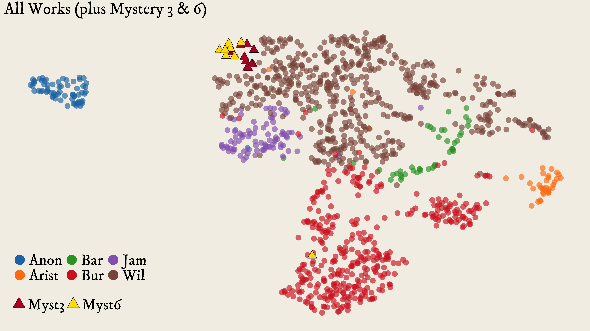

[](https://creativecommons.org/licenses/by/4.0/)

## The Translators’ Touch
#### *A Computational Stylometric Inquiry into Medieval Greek-Latin Translations*



This study focuses on the examination of 12th and 13th-century translators of Greek philosophical and technical texts into Latin. The translations produced by these individuals, particularly Aristotle's works, had a significant impact on intellectual advancements during the later Middle Ages and Early Modern period. Although many of the translators have remained anonymous, identification would provide valuable insight into the cultural transfer process. Conventional methods of identification cannot be applied straightforwardly to translations from this period due to the unique transmission history and inherent qualities of the works. Since the 20th century, scholars have used function words to identify the individual stylistic "fingerprint" of different translators. The current project aims to evaluate established attributions using computational stylometric techniques, ultimately clustering anonymous translations with other Latin versions by known translators. The study will contribute to the fields of translation studies and stylometry, particularly in terms of similarities in the style of late-medieval translators. In terms of methods, we work with unsupervised clustering using dimension reduction (UMAP), bootstrapped Random Forest classification, and feature keyness via mutual information score.

The conference [technical abstract](output/DHBenelux2023_Beullens_Haverals_Nagy.pdf) is available here, as is our [presentation](output/translators_touch_dhb23.pdf) from [DH Benelux 2023](https://2023.dhbenelux.org/).

The directory [src](src) contains Jupyter notebooks that cover all of our methods, and should completely replicate the figures from the presentation.

The directory [figures](figures) contains print-quality figures for the stylometric analysis in both raster and vector format.

The directory [data](data) contains various vectorised (function word frequencies) corpus data. Unfortunately, as often happens, we are not currently licensed to redistribute the raw text files for the corpus, but interested parties are invited to contact us to discuss options.

### Citation

A formal paper is under preparation. To cite this code, you may use something like the following:

Beullens, P., Haverals, W., Nagy, B. (2023) The Translators’ Touch: A Computational Stylometric Inquiry into Medieval Greek-Latin Translations. <DOI goes here>

Bibtex:

```
@software{translators_touch,
    author = {Beullens, Pieter and Haverals, Wouter and Nagy, Benjamin},
    title = "{The Translators’ Touch: A Computational Stylometric Inquiry into Medieval Greek-Latin Translations}",
    year = {2023},
    month = {06},
    doi = {tbd},
    url = {tbd},
}
```